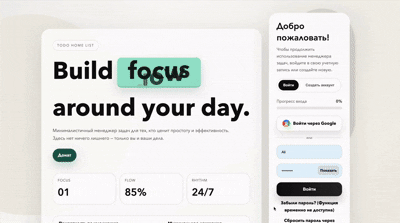

# Todo Home List 📝

Веб-менеджер задач с аутентификацией, интеграцией Telegram-бота и поддержкой Google OAuth.




---

## 🎯 Основные возможности

### Управление задачами

- ✅ Создание, редактирование и удаление задач
- 📊 Фильтрация по статусу (новая, в процессе, сделано, архив)
- 🎯 Установка приоритета (низкий, средний, высокий, срочный)
- 📅 Дедлайны с визуальным отображением просроченных задач
- 🔄 Быстрое переключение статуса прямо из списка

### Аутентификация и безопасность

- 🔐 Регистрация и авторизация пользователей
- 🌐 Вход через Google OAuth (django-allauth)
- 🔑 Восстановление пароля через email
- 🤖 Альтернативное восстановление через Telegram-бота
- 📱 Привязка Telegram аккаунта в настройках профиля
- 🛡️ CSRF защита, защита от SQL injection и XSS

### Интеграции

- 🌐 **Google OAuth** — социальная авторизация через django-allauth
- 💬 **Telegram Bot API** — отправка ссылок для сброса пароля
- 📧 Email-уведомления
- 🍪 **Cookie Consent** — GDPR-совместимый баннер

---

## 🛠️ Технологический стек

### Backend

- **Django 6.0** — веб-фреймворк
- **PostgreSQL 14+** — база данных
- **Python 3.10+** — язык разработки
- **Gunicorn** — WSGI сервер
- **Nginx** — обратный прокси

### Frontend

- **HTML5 / CSS3** — семантичная разметка и стили
- **JavaScript (Vanilla)** — интерактивность
- **AJAX** — асинхронные операции

### DevOps

- **Docker & Docker Compose** — контейнеризация
- **GNU Make** — автоматизация команд

---

## 🚀 Быстрый старт

### Требования

- Docker и Docker Compose
- Git

### Требования

- Docker и Docker Compose
- Git
- Для полного production-запуска: домен и хостинг с доступом по HTTPS. Полный запуск проекта со всеми внешними интеграциями требует домен и хостинг. Без них приложение можно запускать локально через Docker, как показано ниже, но Telegram webhook, YooKassa webhook и production-настройки OAuth будут работать только при доступном внешнем HTTPS-адресе.

### Установка

1. **Клонирование репозитория**

```bash
git clone https://github.com/bailiev7/Todo-Django.git
cd Todo-Django
```

2. **Настройка окружения**

```bash
cp .env.example .env
# Заполни переменные в .env
```

3. **Запуск**

```bash
docker compose up --build
```

4. **Применение миграций**

```bash
docker compose exec web python manage.py migrate
docker compose exec web python manage.py createsuperuser
```

5. **Приложение доступно по адресу**

```
http://localhost:8000
```

---

## ⚙️ Конфигурация

### Основные переменные окружения (.env)

```env
# Django
DJANGO_SECRET_KEY=your-secret-key-here
DJANGO_DEBUG=False
DJANGO_ALLOWED_HOSTS=localhost,127.0.0.1

# PostgreSQL
POSTGRES_DB=mysite
POSTGRES_USER=mysite
POSTGRES_PASSWORD=your-secure-password
POSTGRES_HOST=db
POSTGRES_PORT=5432

# Email
DJANGO_EMAIL_BACKEND=django.core.mail.backends.smtp.EmailBackend
DJANGO_EMAIL_HOST=smtp.gmail.com
DJANGO_EMAIL_PORT=587
DJANGO_EMAIL_HOST_USER=your-email@gmail.com
DJANGO_EMAIL_HOST_PASSWORD=your-app-password
DJANGO_EMAIL_USE_TLS=True

# Google OAuth
GOOGLE_OAUTH_CLIENT_ID=your-google-client-id.apps.googleusercontent.com
GOOGLE_OAUTH_CLIENT_SECRET=your-google-client-secret

# Telegram Bot
TELEGRAM_BOT_TOKEN=123456:ABC-DEF1234ghIkl-zyx57W2v1u123ew11
TELEGRAM_BOT_USERNAME=your_bot_username
TELEGRAM_WEBHOOK_SECRET=your-random-secret-string
```

### Настройка Google OAuth

1. Открой [Google Cloud Console](https://console.cloud.google.com/apis/credentials)
2. Создай OAuth Client ID с типом `Web application`
3. В `Authorized redirect URIs` добавь:
   - `http://localhost:8000/accounts/google/login/callback/`
4. Запиши `Client ID` и `Client secret` в `.env`
5. Примени миграции: `docker compose exec web python manage.py migrate`

### Настройка Telegram Bot

1. Создай бота через @BotFather, получи токен
2. Установи webhook:

```bash
curl -X POST https://api.telegram.org/bot{TOKEN}/setWebhook \
  -H 'Content-Type: application/json' \
  -d '{
    "url": "https://yourdomain.com/telegram/webhook/",
    "secret_token": "your-random-secret-string"
  }'
```

---

## 📖 Использование

1. **Регистрация** — через форму или Google OAuth
2. **Управление задачами** — добавляй, редактируй, меняй статус и приоритет
3. **Привязка Telegram** — в настройках профиля, для восстановления пароля
4. **Восстановление пароля** — через email или Telegram-бота

### Команды через Make

```bash
make migrate        # Применить миграции
make superuser      # Создать суперпользователя
make test           # Запустить тесты
make collectstatic  # Собрать статику
make shell          # Django shell
```

---

## 🌐 API Endpoints

| Метод | Endpoint                    | Описание                      |
| ----- | --------------------------- | ----------------------------- |
| GET   | `/`                         | Главная страница              |
| POST  | `/accounts/register/`       | Регистрация                   |
| POST  | `/accounts/login/`          | Авторизация                   |
| POST  | `/accounts/google/login/`   | Вход через Google             |
| GET   | `/accounts/logout/`         | Выход                         |
| GET   | `/tasks/`                   | Список задач с фильтрацией    |
| POST  | `/tasks/create/`            | Создание задачи               |
| POST  | `/tasks/<id>/update/`       | Обновление задачи             |
| POST  | `/tasks/<id>/delete/`       | Удаление задачи               |
| GET   | `/accounts/settings/`       | Настройки профиля             |
| GET   | `/accounts/password/reset/` | Восстановление пароля (email) |
| POST  | `/telegram/password-reset/` | Восстановление через Telegram |
| GET   | `/telegram/link/`           | Привязка Telegram             |
| POST  | `/telegram/webhook/`        | Webhook от Telegram           |

---

## 🔒 Безопасность

- **CSRF Protection** — токены на всех POST запросах
- **SQL Injection Protection** — Django ORM
- **XSS Protection** — автоматическое экранирование шаблонов
- **Password Security** — bcrypt хеширование
- **Secure Sessions** — httpOnly cookies

### Настройки для production

```env
DJANGO_DEBUG=False
DJANGO_ALLOWED_HOSTS=yourdomain.com
SESSION_COOKIE_SECURE=True
SESSION_COOKIE_HTTPONLY=True
CSRF_COOKIE_SECURE=True
SECURE_HSTS_SECONDS=31536000
```

---

## 🧪 Тестирование

```bash
# Через Make
make test

# Напрямую
docker compose exec web python manage.py test

# С покрытием
docker compose exec web coverage run --source='.' manage.py test
docker compose exec web coverage report
```

---

## 📁 Структура проекта

```
mysite/
├── mysite/                  # Конфиг проекта
│   ├── settings.py
│   ├── urls.py
│   ├── wsgi.py
│   └── asgi.py
├── todo/                    # Основное приложение
│   ├── models.py            # Task, TelegramAccount, и др.
│   ├── views.py
│   ├── forms.py
│   ├── urls.py
│   ├── telegram.py          # Интеграция с Telegram API
│   ├── admin.py
│   └── migrations/
├── templates/
├── static/
├── docker-compose.yml
├── Dockerfile
├── Makefile
├── requirements.txt
└── README.md
```

---

## 🐛 Решение проблем

### Telegram бот не отвечает

1. Проверь `TELEGRAM_BOT_TOKEN` и `TELEGRAM_WEBHOOK_SECRET` в `.env`
2. Убедись, что пользователь привязал Telegram в настройках
3. Проверь логи: `docker compose logs web`

### Миграции не применяются

```bash
docker compose exec web python manage.py migrate --fake-initial
```

### База данных не подключается

```bash
docker compose down
docker compose up --build
```

---

## 📞 Контакты

| Канал       | Ссылка                           |
| ----------- | -------------------------------- |
| 💬 Telegram | [@bailiev](https://t.me/bailiev) |
| 📧 Email    | a.baylyyew05@gmail.com           |

---

_Последнее обновление: Май 2026_
